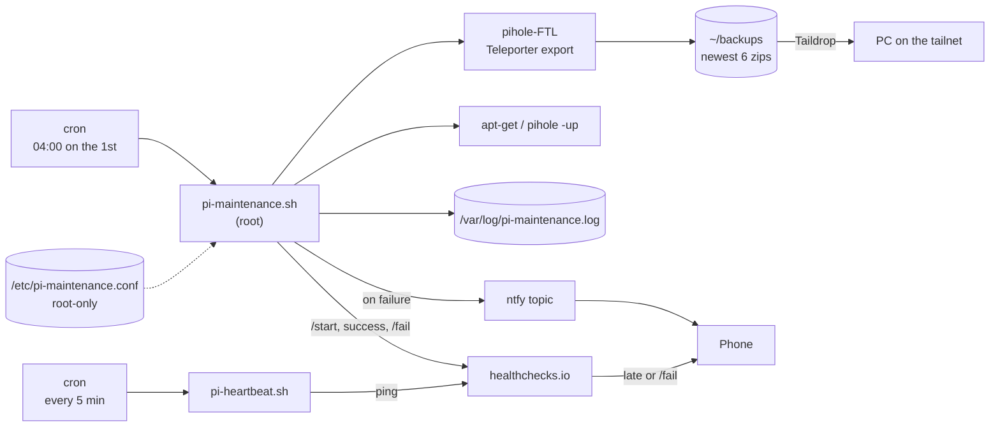

# pi-maintenance

Unattended monthly maintenance for a Raspberry Pi running **Pi-hole + Unbound**.
Once a month it backs up Pi-hole, patches the OS and Pi-hole, checks that the DNS
services are still running, and reboots only when everything went well. If any step fails,
it pushes an alert to your phone through [ntfy](https://ntfy.sh). A
[healthchecks.io](https://healthchecks.io) dead-man switch covers the failures the Pi
can't report itself: it's off, offline, or the job never ran.

Built for a home network where the Pi is the DNS server for every device, so a
bad upgrade that goes unnoticed means the whole house loses the internet.

## What it does

Each run executes these steps in order and logs the result of every one:

| # | Step | What happens | If it fails |
|---|------|--------------|-------------|
| 1 | `backup` | `pihole-FTL --teleporter` exports all Pi-hole settings to a zip, and the script checks that a new, non-empty file appeared | **Run stops.** No upgrades without a restore point. Alert sent. |
| 2 | `prune` | Deletes all but the newest `KEEP_BACKUPS` exports (default 6) | Logged and alerted; run continues |
| 3 | `taildrop` | Copies the newest export to a PC over [Taildrop](https://tailscale.com/kb/1106/taildrop) for an off-device copy | **Warning only.** The PC may be asleep; the backup stays on the Pi |
| 4 | `apt-update` | `apt-get update` | Upgrade is skipped; alert sent |
| 5 | `apt-upgrade` | Non-interactive `apt-get full-upgrade`, keeping existing config files when packages ship new ones | Alert sent |
| 6 | `pihole-update` | `pihole -up` (core, web UI, FTL) | Alert sent |
| 7 | `services` | Confirms `pihole-FTL` and `unbound` are still active | Alert sent |
| 8 | reboot | Reboots if `/var/run/reboot-required` exists **and** nothing failed | Reboot is skipped so you can inspect a working-but-degraded Pi |

Long-running steps have a timeout (`STEP_TIMEOUT`, default 45 min), a lock file
stops two runs from overlapping, and a run interrupted by a signal still sends
an alert.

## Architecture



```
.
├── bin/pi-maintenance.sh             # the maintenance script -> /usr/local/bin/
├── bin/pi-heartbeat.sh               # dead-man switch ping    -> /usr/local/bin/
├── etc/cron.d/pi-maintenance         # schedule                -> /etc/cron.d/
├── etc/cron.d/pi-heartbeat           # heartbeat, every 5 min  -> /etc/cron.d/
├── etc/logrotate.d/pi-maintenance    # yearly log rotation     -> /etc/logrotate.d/
├── etc/pi-maintenance.conf.example   # documented config template
├── install.sh                        # installs all of the above
└── hardening/                        # optional: firewall, fail2ban, key-only SSH
    ├── harden.sh                     # applies it (see Hardening below)
    ├── verify.sh                     # read-only status check
    └── etc/                          # sshd drop-in and fail2ban jail
```

## Setup

Requirements: Pi-hole v6 (for `pihole-FTL --teleporter`), `curl`, and optionally
Tailscale for the off-device copy.

```bash
git clone https://github.com/<you>/pi-maintenance.git
cd pi-maintenance
sudo ./install.sh
```

`install.sh`:

1. Takes a Teleporter backup before changing anything.
2. On first install, creates `/etc/pi-maintenance.conf` (owner root, mode 600) with a
   **random ntfy topic**, asks for the Taildrop device name, and prints the topic once.
3. Asks for the healthchecks.io ping URLs if they're missing (blank skips them; see
   [Dead-man switch](#dead-man-switch)).
4. Installs the scripts, cron jobs and logrotate rule.
5. Sends a test alert, and a first heartbeat if its URL is set.

Subscribe to the printed topic in the ntfy app (Android/iOS/web) before
the test alert is sent. To re-send one later:

```bash
sudo pi-maintenance.sh --test-alert
```

To run maintenance by hand (output is shown and also logged):

```bash
sudo pi-maintenance.sh
```

Settings are documented in [`etc/pi-maintenance.conf.example`](etc/pi-maintenance.conf.example).

## Sample log output

A successful run (apt and Pi-hole output trimmed):

```
2026-10-01 04:00:01 === pi-maintenance start (pid 4127) ===
2026-10-01 04:00:01 START backup
pi-hole_pihole_teleporter_2026-10-01_04-00-01_EDT.zip
2026-10-01 04:00:02 backup: /home/<user>/backups/pi-hole_pihole_teleporter_2026-10-01_04-00-01_EDT.zip
2026-10-01 04:00:02 OK    backup
2026-10-01 04:00:02 START prune
2026-10-01 04:00:02 pruned 1 old backup(s)
2026-10-01 04:00:02 OK    prune
2026-10-01 04:00:02 START taildrop
2026-10-01 04:00:04 OK    taildrop
2026-10-01 04:00:04 START apt-update
Hit:1 http://deb.debian.org/debian trixie InRelease
...
2026-10-01 04:00:09 OK    apt-update
2026-10-01 04:00:09 START apt-upgrade
0 upgraded, 0 newly installed, 0 to remove and 0 not upgraded.
2026-10-01 04:00:11 OK    apt-upgrade
2026-10-01 04:00:11 START pihole-update
  [✓] Everything is up to date!
2026-10-01 04:00:40 OK    pihole-update
2026-10-01 04:00:40 START services
2026-10-01 04:00:40 pihole-FTL is active
2026-10-01 04:00:40 unbound is active
2026-10-01 04:00:40 OK    services
2026-10-01 04:00:40 === finished OK ===
```

A run where the package mirror was unreachable and the PC was asleep:

```
2026-11-01 04:00:02 WARN  taildrop to <pc> failed; backup kept on the Pi
2026-11-01 04:00:02 START apt-update
2026-11-01 04:00:32 FAIL  apt-update (exit 100)
2026-11-01 04:00:32 SKIP  apt-upgrade (apt-update failed)
...
2026-11-01 04:01:05 === finished with failures: apt-update ===
```

…which sends this push notification:

> **pihole maintenance failed**
> Failed: apt-update. Warnings: Taildrop to &lt;pc&gt; failed (PC offline?); backup kept on the Pi. See /var/log/pi-maintenance.log on pihole.

## Dead-man switch

ntfy alerts are *pushed* by the Pi, so they can't tell you about a Pi that is off,
frozen, offline, or whose cron has stopped. Silence looks the same as "all good".
A dead-man switch flips this around: the Pi checks in with
[healthchecks.io](https://healthchecks.io) on a schedule, and **healthchecks.io
alerts you when a check-in is late**. Nothing on the Pi has to work for that alert
to go out.

Two checks:

| Check | Pinged by | What it catches | Suggested settings |
|-------|-----------|-----------------|--------------------|
| **Heartbeat** | `pi-heartbeat.sh`, every 5 min from `/etc/cron.d/pi-heartbeat` | Pi off, frozen or offline; cron not running. If the Pi resolves DNS through its own Pi-hole, a broken DNS stack too | Simple, period 5 min, grace 10 min |
| **Maintenance** | `pi-maintenance.sh`: `/start` when it begins, then success or `/fail` | A failed run; a run that never started; a run that started and never finished (hung, or the Pi didn't come back from the reboot) | Cron `0 4 1 * *` in the Pi's time zone, grace 3 hours (the upgrade steps can each take up to `STEP_TIMEOUT`) |

Setup:

1. Create both checks on healthchecks.io and connect them to a notification channel
   (the ntfy integration or the phone app both work).
2. Run `sudo ./install.sh` and paste the two ping URLs when asked. They're stored only in
   `/etc/pi-maintenance.conf`. Anyone with a ping URL can fake a ping, so treat them
   like the ntfy topic.
3. The heartbeat goes green right away. The maintenance check stays "new" (and silent)
   until the first run. Run `sudo pi-maintenance.sh` by hand to arm it now.

If a URL is blank, that part is skipped silently. Curl uses `-m 10 --retry 5`, so one
flaky request doesn't cause a false alarm, and a heartbeat always finishes long before
the next one. `sudo hardening/verify.sh` shows whether each URL is set (never the URL
itself) and the result of the last heartbeat.

**Log lines on failure (opt-in).** With `HC_SEND_LOG=true`, a `/fail` ping carries the last
20 lines of the log, so the context is right there in healthchecks.io. Those lines can
include the hostname, backup paths (with your username), the Taildrop PC name and apt
output, which is why it's off unless you say yes during install.

## Design notes

- **Fail safe, not fail silent.** The first version of this job ran every command
  regardless of what came before and always printed `done`. It also relied on cron's
  default `PATH` (`/usr/bin:/bin`), which doesn't include `pihole` or `reboot`, so
  those two steps would have failed quietly on every scheduled run.
- **No `set -e`.** Each step is run through `run_step`, which records its exit code.
  That keeps the control flow explicit: which failures stop the run, which skip a
  dependent step, and which are only warnings.
- **Backup is a hard gate.** Nothing is upgraded unless a fresh Teleporter export exists.
- **No reboot after a partial failure.** A Pi that's still serving DNS is better than
  one that may not come back.

## Security notes

- **Runs as root** (apt, `pihole -up` and reboot need it). The config file is sourced by
  that root process, so the script refuses to load it unless it's owned by root and not
  group- or world-writable.
- **The ntfy topic is a shared secret.** Anyone who knows it can read and post to it. It's
  generated randomly on the Pi, stored only in the root-only config, and never committed.
  For stronger guarantees, point `NTFY_SERVER` at a self-hosted ntfy with access tokens.
- **Alerts contain no log content**, only step names and the hostname, because the
  public ntfy server is a third party. healthchecks.io is also a third party: it gets
  log lines only if you opt in with `HC_SEND_LOG=true`.
- **healthchecks.io ping URLs are secrets too.** Like the ntfy topic, they live only in
  the root-only config. `install.sh` accepts only URL-safe characters, because the
  config is sourced as root.
- **Backups contain your Pi-hole configuration.** They're created with `umask 077`
  (root-only), kept on the Pi, sent only inside your tailnet, and gitignored.
- **Unattended upgrades carry risk.** This is mitigated by the pre-upgrade backup,
  keeping existing config files during upgrades, the post-upgrade service check, and
  skipping reboot on failure.
- **Remote access** is key-based SSH over Tailscale. No ports are exposed to the internet.
- The repo uses placeholders (`<user>`, `<pc>`, `<pi-tailscale-ip>`) instead of real
  hostnames, IPs or usernames.

## Hardening

`hardening/harden.sh` locks the Pi down so that only your home network and your tailnet
can reach it, and only with an SSH key. It's separate from the maintenance job and
optional.

```bash
sudo hardening/harden.sh              # account to check defaults to the one you sudo from
sudo hardening/harden.sh --user <user>
sudo hardening/verify.sh              # read-only; prints status and OK/FAIL checks,
                                      # including the dead-man switch
```

| Part | What it does | What it stops |
|------|--------------|---------------|
| **ufw** firewall | Denies incoming and routed traffic by default. Allows SSH (22), DNS (53 tcp/udp) and the web UI (80/443) only from `192.168.0.0/24` and `tailscale0`, plus Tailscale's UDP 41641 from anywhere. Allows forwarding from `tailscale0` out of the LAN interface so the Pi still works as an exit node. | Anything outside the LAN/tailnet reaching Pi-hole, SSH or a service you didn't know was listening (e.g. after a router port-forward by mistake). |
| **fail2ban** | Bans an IP for 1 hour after 5 failed SSH logins in 10 minutes. Never bans loopback, the LAN or the tailnet. | Password guessing. With the firewall on and key-only SSH, this is a second line of defense: it only matters if SSH is ever exposed. |
| **Key-only SSH** | `/etc/ssh/sshd_config.d/00-hardening.conf`: no passwords, no keyboard-interactive, no root login. | Brute-forced, reused or leaked passwords, and direct root login. |

Safety:

- **Won't lock you out:** refuses to run unless your `~/.ssh/authorized_keys` holds a
  valid key with permissions sshd accepts.
- **Validates first:** the SSH drop-in is checked with `sshd -t` and `sshd -T`, and SSH
  is reloaded only if both pass. Otherwise the previous file is restored.
- **Firewall safety timer:** the first time ufw is enabled, a timer turns it off again
  after 5 minutes unless you confirm that a *new* SSH session works.
- **Backups:** takes a Teleporter backup first, and copies every file it replaces to
  `/var/backups/pi-hardening/<timestamp>/`.
- **Safe to re-run:** it only adds ufw rules and never resets them. If you change `LAN=`
  in `harden.sh` (keep `ignoreip` in the jail file in sync), delete the old rules with
  `sudo ufw status numbered` and `sudo ufw delete <n>`.

Keep your current SSH session open until `ssh pihole true` works from a new terminal and
a password login is refused:

```bash
ssh -o PubkeyAuthentication=no -o PreferredAuthentications=password pihole
# expected: Permission denied (publickey).
```

**Why UDP 41641?** Tailscale devices try to talk to each other directly over this
port. If they can't, the traffic is relayed through Tailscale's DERP servers. It stays
end-to-end encrypted, but it's slower, which you notice when the Pi is your exit node.
The port only answers WireGuard packets authenticated with keys from your tailnet, so opening it
adds very little attack surface.

Undo:

```bash
sudo ufw disable
sudo rm /etc/fail2ban/jail.d/sshd.local && sudo systemctl restart fail2ban
sudo rm /etc/ssh/sshd_config.d/00-hardening.conf && sudo systemctl reload ssh
```

## License

MIT
