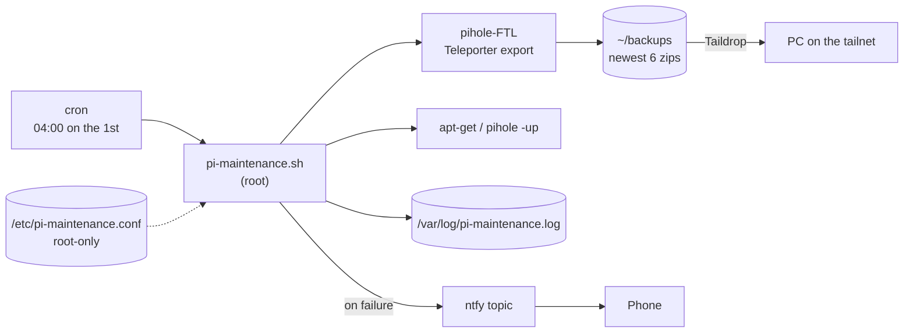

# pi-maintenance

Unattended monthly maintenance for a Raspberry Pi running **Pi-hole + Unbound**.
Once a month it backs up Pi-hole, patches the OS and Pi-hole, checks that the DNS
services are still running, and reboots only when everything went well. If any step fails,
it pushes an alert to your phone through [ntfy](https://ntfy.sh).

Built for a home network where the Pi is the DNS server for every device, so a
bad upgrade that goes unnoticed means the whole house loses the internet.

## What it does

Each run executes these steps in order and logs the result of every one:

| # | Step | What happens | If it fails |
|---|------|--------------|-------------|
| 1 | `backup` | `pihole-FTL --teleporter` exports all Pi-hole settings to a zip, and the script checks that a new, non-empty file appeared | **Run stops.** No upgrades without a restore point. Alert sent. |
| 2 | `prune` | Deletes all but the newest `KEEP_BACKUPS` exports (default 6) | Logged and alerted; run continues |
| 3 | `taildrop` | Copies the newest export to a PC over [Taildrop](https://tailscale.com/kb/1106/taildrop) for an off-device copy | **Warning only.** The PC may be asleep; the backup stays on the Pi |
| 4 | `apt-update` | `apt-get update` | Upgrade is skipped; alert sent |
| 5 | `apt-upgrade` | Non-interactive `apt-get full-upgrade`, keeping existing config files when packages ship new ones | Alert sent |
| 6 | `pihole-update` | `pihole -up` (core, web UI, FTL) | Alert sent |
| 7 | `services` | Confirms `pihole-FTL` and `unbound` are still active | Alert sent |
| 8 | reboot | Reboots if `/var/run/reboot-required` exists **and** nothing failed | Reboot is skipped so you can inspect a working-but-degraded Pi |

Long-running steps have a timeout (`STEP_TIMEOUT`, default 45 min), a lock file
stops two runs from overlapping, and a run interrupted by a signal still sends
an alert.

## Architecture



```
.
├── bin/pi-maintenance.sh             # the maintenance script -> /usr/local/bin/
├── etc/cron.d/pi-maintenance         # schedule                -> /etc/cron.d/
├── etc/logrotate.d/pi-maintenance    # yearly log rotation     -> /etc/logrotate.d/
├── etc/pi-maintenance.conf.example   # documented config template
└── install.sh                        # installs all of the above
```

## Setup

Requirements: Pi-hole v6 (for `pihole-FTL --teleporter`), `curl`, and optionally
Tailscale for the off-device copy.

```bash
git clone https://github.com/<you>/pi-maintenance.git
cd pi-maintenance
sudo ./install.sh
```

`install.sh`:

1. Takes a Teleporter backup before changing anything.
2. On first install, creates `/etc/pi-maintenance.conf` (owner root, mode 600) with a
   **random ntfy topic**, asks for the Taildrop device name, and prints the topic once.
3. Installs the script, cron job and logrotate rule.
4. Sends a test alert.

Subscribe to the printed topic in the ntfy app (Android/iOS/web) before
the test alert is sent. To re-send one later:

```bash
sudo pi-maintenance.sh --test-alert
```

To run maintenance by hand (output is shown and also logged):

```bash
sudo pi-maintenance.sh
```

Settings are documented in [`etc/pi-maintenance.conf.example`](etc/pi-maintenance.conf.example).

## Sample log output

A successful run (apt and Pi-hole output trimmed):

```
2026-10-01 04:00:01 === pi-maintenance start (pid 4127) ===
2026-10-01 04:00:01 START backup
pi-hole_pihole_teleporter_2026-10-01_04-00-01_EDT.zip
2026-10-01 04:00:02 backup: /home/<user>/backups/pi-hole_pihole_teleporter_2026-10-01_04-00-01_EDT.zip
2026-10-01 04:00:02 OK    backup
2026-10-01 04:00:02 START prune
2026-10-01 04:00:02 pruned 1 old backup(s)
2026-10-01 04:00:02 OK    prune
2026-10-01 04:00:02 START taildrop
2026-10-01 04:00:04 OK    taildrop
2026-10-01 04:00:04 START apt-update
Hit:1 http://deb.debian.org/debian trixie InRelease
...
2026-10-01 04:00:09 OK    apt-update
2026-10-01 04:00:09 START apt-upgrade
0 upgraded, 0 newly installed, 0 to remove and 0 not upgraded.
2026-10-01 04:00:11 OK    apt-upgrade
2026-10-01 04:00:11 START pihole-update
  [✓] Everything is up to date!
2026-10-01 04:00:40 OK    pihole-update
2026-10-01 04:00:40 START services
2026-10-01 04:00:40 pihole-FTL is active
2026-10-01 04:00:40 unbound is active
2026-10-01 04:00:40 OK    services
2026-10-01 04:00:40 === finished OK ===
```

A run where the package mirror was unreachable and the PC was asleep:

```
2026-11-01 04:00:02 WARN  taildrop to <pc> failed; backup kept on the Pi
2026-11-01 04:00:02 START apt-update
2026-11-01 04:00:32 FAIL  apt-update (exit 100)
2026-11-01 04:00:32 SKIP  apt-upgrade (apt-update failed)
...
2026-11-01 04:01:05 === finished with failures: apt-update ===
```

…which sends this push notification:

> **pihole maintenance failed**
> Failed: apt-update. Warnings: Taildrop to &lt;pc&gt; failed (PC offline?); backup kept on the Pi. See /var/log/pi-maintenance.log on pihole.

## Design notes

- **Fail safe, not fail silent.** The first version of this job ran every command
  regardless of what came before and always printed `done`. It also relied on cron's
  default `PATH` (`/usr/bin:/bin`), which doesn't include `pihole` or `reboot`, so
  those two steps would have failed quietly on every scheduled run.
- **No `set -e`.** Each step is run through `run_step`, which records its exit code.
  That keeps the control flow explicit: which failures stop the run, which skip a
  dependent step, and which are only warnings.
- **Backup is a hard gate.** Nothing is upgraded unless a fresh Teleporter export exists.
- **No reboot after a partial failure.** A Pi that's still serving DNS is better than
  one that may not come back.

## Security notes

- **Runs as root** (apt, `pihole -up` and reboot need it). The config file is sourced by
  that root process, so the script refuses to load it unless it's owned by root and not
  group- or world-writable.
- **The ntfy topic is a shared secret.** Anyone who knows it can read and post to it. It's
  generated randomly on the Pi, stored only in the root-only config, and never committed.
  For stronger guarantees, point `NTFY_SERVER` at a self-hosted ntfy with access tokens.
- **Alerts contain no log content**, only step names and the hostname, because the
  public ntfy server is a third party.
- **Backups contain your Pi-hole configuration.** They're created with `umask 077`
  (root-only), kept on the Pi, sent only inside your tailnet, and gitignored.
- **Unattended upgrades carry risk.** This is mitigated by the pre-upgrade backup,
  keeping existing config files during upgrades, the post-upgrade service check, and
  skipping reboot on failure.
- **Remote access** is key-based SSH over Tailscale. No ports are exposed to the internet.
- The repo uses placeholders (`<user>`, `<pc>`, `<pi-tailscale-ip>`) instead of real
  hostnames, IPs or usernames.

## License

MIT
