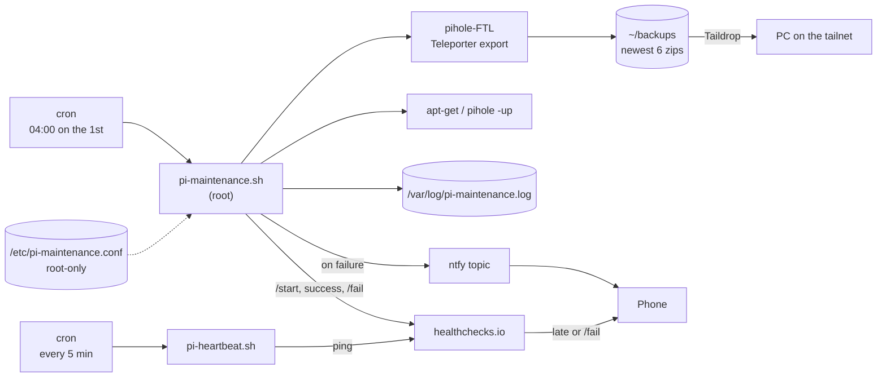

# pi-maintenance

Unattended monthly maintenance for a Raspberry Pi running **Pi-hole + Unbound**.
Once a month it backs up Pi-hole, patches the OS and Pi-hole, checks that the DNS
services are still running, and reboots only when everything went well. If any step fails,
it pushes an alert to your phone through [ntfy](https://ntfy.sh). A
[healthchecks.io](https://healthchecks.io) dead-man switch covers the failures the Pi
can't report itself: it's off, offline, or the job never ran. Optionally,
[Uptime Kuma](#monitoring) watches DNS, the web UI and your websites from the Pi,
and an [OpenCanary honeypot](#honeypot) alerts you when something on your network
probes the Pi.

Built for a home network where the Pi is the DNS server for every device, so a
bad upgrade that goes unnoticed means the whole house loses the internet.

## What it does

Each run executes these steps in order and logs the result of every one:

| # | Step | What happens | If it fails |
|---|------|--------------|-------------|
| 1 | `backup` | `pihole-FTL --teleporter` exports all Pi-hole settings to a zip, and the script checks that a new, non-empty file appeared | **Run stops.** No upgrades without a restore point. Alert sent. |
| 2 | `prune` | Deletes all but the newest `KEEP_BACKUPS` exports (default 6) | Logged and alerted; run continues |
| 3 | `taildrop` | Copies the newest export to a PC over [Taildrop](https://tailscale.com/kb/1106/taildrop) for an off-device copy | **Warning only.** The PC may be asleep; the backup stays on the Pi |
| 4 | `apt-update` | `apt-get update` | Upgrade is skipped; alert sent |
| 5 | `apt-upgrade` | Non-interactive `apt-get full-upgrade`, keeping existing config files when packages ship new ones | Alert sent |
| 6 | `pihole-update` | `pihole -up` (core, web UI, FTL) | Alert sent |
| 7 | `services` | Confirms `pihole-FTL` and `unbound` are still active | Alert sent |
| 8 | reboot | Reboots if `/var/run/reboot-required` exists **and** nothing failed | Reboot is skipped so you can inspect a working-but-degraded Pi |

Long-running steps have a timeout (`STEP_TIMEOUT`, default 45 min), a lock file
stops two runs from overlapping, and a run interrupted by a signal still sends
an alert.

## Architecture



```
.
├── bin/pi-maintenance.sh             # the maintenance script -> /usr/local/bin/
├── bin/pi-heartbeat.sh               # dead-man switch ping    -> /usr/local/bin/
├── etc/cron.d/pi-maintenance         # schedule                -> /etc/cron.d/
├── etc/cron.d/pi-heartbeat           # heartbeat, every 5 min  -> /etc/cron.d/
├── etc/logrotate.d/pi-maintenance    # yearly log rotation     -> /etc/logrotate.d/
├── etc/pi-maintenance.conf.example   # documented config template
├── install.sh                        # installs all of the above
├── hardening/                        # optional: firewall, fail2ban, key-only SSH
│   ├── harden.sh                     # applies it (see Hardening below)
│   ├── verify.sh                     # read-only status check
│   └── etc/                          # sshd drop-in and fail2ban jail
├── monitoring/                       # optional: Uptime Kuma dashboard
│   ├── install.sh                    # install/upgrade (see Monitoring below)
│   └── uptime-kuma.service           # systemd unit      -> /etc/systemd/system/
└── canary/                           # optional: OpenCanary honeypot
    ├── install.sh                    # install/upgrade (see Honeypot below)
    ├── opencanary.conf               # fake services     -> /etc/opencanaryd/
    ├── opencanary.service            # systemd unit      -> /etc/systemd/system/
    └── pi_canary_ntfy.py             # ntfy alerts       -> /usr/local/lib/opencanary-ntfy/
```

## Setup

Requirements: Pi-hole v6 (for `pihole-FTL --teleporter`), `curl`, and optionally
Tailscale for the off-device copy.

```bash
git clone https://github.com/<you>/pi-maintenance.git
cd pi-maintenance
sudo ./install.sh
```

`install.sh`:

1. Takes a Teleporter backup before changing anything.
2. On first install, creates `/etc/pi-maintenance.conf` (owner root, mode 600) with a
   **random ntfy topic**, asks for the Taildrop device name, and prints the topic once.
3. Asks for the healthchecks.io ping URLs if they're missing (blank skips them; see
   [Dead-man switch](#dead-man-switch)).
4. Installs the scripts, cron jobs and logrotate rule.
5. Sends a test alert, and a first heartbeat if its URL is set.

Subscribe to the printed topic in the ntfy app (Android/iOS/web) before
the test alert is sent. To re-send one later:

```bash
sudo pi-maintenance.sh --test-alert
```

To run maintenance by hand (output is shown and also logged):

```bash
sudo pi-maintenance.sh
```

Settings are documented in [`etc/pi-maintenance.conf.example`](etc/pi-maintenance.conf.example).

## Sample log output

A successful run (apt and Pi-hole output trimmed):

```
2026-10-01 04:00:01 === pi-maintenance start (pid 4127) ===
2026-10-01 04:00:01 START backup
pi-hole_pihole_teleporter_2026-10-01_04-00-01_EDT.zip
2026-10-01 04:00:02 backup: /home/<user>/backups/pi-hole_pihole_teleporter_2026-10-01_04-00-01_EDT.zip
2026-10-01 04:00:02 OK    backup
2026-10-01 04:00:02 START prune
2026-10-01 04:00:02 pruned 1 old backup(s)
2026-10-01 04:00:02 OK    prune
2026-10-01 04:00:02 START taildrop
2026-10-01 04:00:04 OK    taildrop
2026-10-01 04:00:04 START apt-update
Hit:1 http://deb.debian.org/debian trixie InRelease
...
2026-10-01 04:00:09 OK    apt-update
2026-10-01 04:00:09 START apt-upgrade
0 upgraded, 0 newly installed, 0 to remove and 0 not upgraded.
2026-10-01 04:00:11 OK    apt-upgrade
2026-10-01 04:00:11 START pihole-update
  [✓] Everything is up to date!
2026-10-01 04:00:40 OK    pihole-update
2026-10-01 04:00:40 START services
2026-10-01 04:00:40 pihole-FTL is active
2026-10-01 04:00:40 unbound is active
2026-10-01 04:00:40 OK    services
2026-10-01 04:00:40 === finished OK ===
```

A run where the package mirror was unreachable and the PC was asleep:

```
2026-11-01 04:00:02 WARN  taildrop to <pc> failed; backup kept on the Pi
2026-11-01 04:00:02 START apt-update
2026-11-01 04:00:32 FAIL  apt-update (exit 100)
2026-11-01 04:00:32 SKIP  apt-upgrade (apt-update failed)
...
2026-11-01 04:01:05 === finished with failures: apt-update ===
```

…which sends this push notification:

> **pihole maintenance failed**
> Failed: apt-update. Warnings: Taildrop to &lt;pc&gt; failed (PC offline?); backup kept on the Pi. See /var/log/pi-maintenance.log on pihole.

## Dead-man switch

ntfy alerts are *pushed* by the Pi, so they can't tell you about a Pi that is off,
frozen, offline, or whose cron has stopped. Silence looks the same as "all good".
A dead-man switch flips this around: the Pi checks in with
[healthchecks.io](https://healthchecks.io) on a schedule, and **healthchecks.io
alerts you when a check-in is late**. Nothing on the Pi has to work for that alert
to go out.

Two checks:

| Check | Pinged by | What it catches | Suggested settings |
|-------|-----------|-----------------|--------------------|
| **Heartbeat** | `pi-heartbeat.sh`, every 5 min from `/etc/cron.d/pi-heartbeat` | Pi off, frozen or offline; cron not running. If the Pi resolves DNS through its own Pi-hole, a broken DNS stack too | Simple, period 5 min, grace 10 min |
| **Maintenance** | `pi-maintenance.sh`: `/start` when it begins, then success or `/fail` | A failed run; a run that never started; a run that started and never finished (hung, or the Pi didn't come back from the reboot) | Cron `0 4 1 * *` in the Pi's time zone, grace 3 hours (the upgrade steps can each take up to `STEP_TIMEOUT`) |

Setup:

1. Create both checks on healthchecks.io and connect them to a notification channel
   (the ntfy integration or the phone app both work).
2. Run `sudo ./install.sh` and paste the two ping URLs when asked. They're stored only in
   `/etc/pi-maintenance.conf`. Anyone with a ping URL can fake a ping, so treat them
   like the ntfy topic.
3. The heartbeat goes green right away. The maintenance check stays "new" (and silent)
   until the first run. Run `sudo pi-maintenance.sh` by hand to arm it now.

If a URL is blank, that part is skipped silently. Curl uses `-m 10 --retry 5`, so one
flaky request doesn't cause a false alarm, and a heartbeat always finishes long before
the next one. `sudo hardening/verify.sh` shows whether each URL is set (never the URL
itself) and the result of the last heartbeat.

**Log lines on failure (opt-in).** With `HC_SEND_LOG=true`, a `/fail` ping carries the last
20 lines of the log, so the context is right there in healthchecks.io. Those lines can
include the hostname, backup paths (with your username), the Taildrop PC name and apt
output, which is why it's off unless you say yes during install.

## Monitoring

[Uptime Kuma](https://github.com/louislam/uptime-kuma) is a self-hosted dashboard that
checks services on a schedule, graphs their history and notifies you when one goes
down. It runs **on** the Pi, so it can't report the Pi itself being down. That's the
[dead-man switch](#dead-man-switch)'s job. Kuma covers "the Pi is up, but DNS, the web
UI or one of your websites is broken".

```bash
sudo monitoring/install.sh     # install, or upgrade after changing KUMA_VERSION
sudo hardening/harden.sh       # re-run once, to open port 3001 to the LAN and tailnet
```

**Then, right away:** open `http://<pi-address>:3001` and create the admin account.
Kuma has no default password: the *first visitor* sets it up. If it asks which database
to use, choose **SQLite**.

### Why native Node and not Docker

On a 1 GB Pi 3B+ that is also running Pi-hole and Unbound:

- **RAM.** Docker's daemons use roughly 60–100 MB before Kuma even starts. Native Kuma
  with a handful of monitors typically needs 100–150 MB. Check headroom with `free -h`
  and read the **available** column, not **free**: "buff/cache" is file cache the
  kernel hands back when a program needs it.
- **Firewall.** Ports published by Docker skip ufw, because Docker inserts its own
  iptables rules ahead of ufw's. The "LAN and tailnet only" rule for 3001 would
  silently not apply.
- **Updates.** Node.js comes from Debian (trixie ships 20.x, and Kuma needs >= 20.4),
  so the monthly `apt full-upgrade` patches it. There's no third-party repository.

The docs suggest PM2 to keep Kuma running. systemd already does that job, so there's no
extra daemon, and it adds memory limits and sandboxing:

| Setting | Why |
|---|---|
| `User=uptime-kuma` | Runs as a dedicated system user with no login shell, not root |
| `MemoryHigh=250M`, `MemoryMax=350M`, Node heap 200 MB | A memory leak gets throttled and then restarted, instead of starving DNS |
| `ProtectSystem=strict`, `ReadWritePaths=/var/lib/uptime-kuma` | Everything except its own data is read-only to it |
| `NoNewPrivileges`, `ProtectHome`, `PrivateTmp`, `PrivateDevices` | Can't gain privileges or see home folders, /tmp or devices |
| `CAP_NET_RAW` only | The one privilege ping monitors need |

### What install.sh does

1. Checks the architecture (arm64/amd64) and takes a Teleporter backup.
2. Installs `nodejs`, `npm` and `git` from Debian if missing, and checks Node >= 20.4.
3. Creates the `uptime-kuma` system user and `/var/lib/uptime-kuma` (mode 700).
4. If `/opt/uptime-kuma` isn't already at `KUMA_VERSION` (pinned, currently 2.5.5):
   - clones that release into a staging folder and runs `npm ci` and `download-dist`
     **as `uptime-kuma`**, because npm packages run install scripts;
   - hands the finished files to root, so the service can't modify its own code;
   - stops Kuma, backs up its data to `/var/backups/uptime-kuma/<timestamp>/`,
     keeps the old app in `/opt/uptime-kuma.prev`, and swaps in the new one.

   A failed build leaves the running version untouched.
5. Installs the systemd unit (backing up a changed one), enables it, and waits for
   port 3001 to answer.

If `npm ci` fails while compiling `sqlite3`, the prebuilt binary wasn't available.
Rather than compiling on a 1 GB Pi, check the Uptime Kuma issues for your version.

### Monitors to add

Add these by hand in the web UI (**Add New Monitor**). The domains below are
placeholders: type your real ones into Kuma, where they stay on the Pi.

| Monitor | Type | Settings | What it tells you |
|---|---|---|---|
| Pi-hole DNS | DNS | Hostname `example.com`, resolver `127.0.0.1`, port `53`, record `A` | Whether devices on your network can resolve names (Pi-hole → Unbound → internet) |
| Unbound | DNS | Hostname `example.com`, resolver `127.0.0.1`, port `5335`, record `A` | Whether Unbound resolves on its own, bypassing Pi-hole |
| Pi-hole web UI | HTTP(s) | URL `http://127.0.0.1/admin/` (redirects to the login page; Kuma follows it) | The admin UI is being served |
| Website 1 | HTTP(s) | URL `https://example.com`, tick **Certificate Expiry Notification** | The site is up and returns 2xx; you're warned before its TLS certificate expires |
| Website 2 | HTTP(s) | URL `https://www.example.org`, same | Same |
| Website 1 mail (optional) | DNS | Hostname `example.com`, resolver `1.1.1.1`, port `53`, record **`MX`** | The domain still publishes mail servers, so email to it can be delivered |
| Website 2 mail (optional) | DNS | Hostname `example.org`, same | Same |

Reading the two DNS monitors together (Pi-hole forwards to Unbound):

- **Both down:** look at Unbound or the internet connection first.
- **Only Pi-hole DNS down:** look at `pihole-FTL`.
- Pi-hole may keep answering cached names for a while after Unbound fails.

**Certificate expiry:** HTTPS certificates are valid for a limited time (often 90 days)
and renew automatically, until renewal silently breaks. Kuma checks the certificate on
every HTTPS check and notifies you as expiry approaches. Set the warning days under
**Settings → Notifications → TLS Certificate Expiry**.

**MX monitors use a public resolver (`1.1.1.1`) on purpose.** They test what the rest
of the internet sees for your domain, not your own Pi-hole. A broken MX record, often
from a DNS change at the registrar, stops incoming email without any website going down.
For the MX monitor, register the mail domain (usually the bare domain, without `www.`).

### ntfy notifications

Use the same ntfy topic as pi-maintenance, so every alert lands in one place:

1. On the Pi, show the topic on your own screen (it's in the root-only config and
   must never be committed):
   ```bash
   sudo grep '^NTFY_TOPIC=' /etc/pi-maintenance.conf
   ```
2. In Kuma, go to **Settings → Notifications → Setup Notification**:
   - Notification type: **ntfy**
   - Server URL: `https://ntfy.sh` (or your `NTFY_SERVER`)
   - Topic: the value from step 1
   - Tick **Default enabled** and **Apply on all existing monitors**
3. Click **Test**. A message should arrive in the ntfy app.

The topic is then also stored in Kuma's database in `/var/lib/uptime-kuma` (mode 700,
owned by `uptime-kuma`), and copied into backups made on upgrade
(`/var/backups/uptime-kuma`, root-only).

### Upgrade, roll back, remove

- **Upgrade:** set `KUMA_VERSION` in `monitoring/install.sh` to the new
  [release](https://github.com/louislam/uptime-kuma/releases), read its release notes,
  and re-run the script.
- **Roll back** to the previous version:
  ```bash
  sudo systemctl stop uptime-kuma
  sudo mv /opt/uptime-kuma /opt/uptime-kuma.bad && sudo mv /opt/uptime-kuma.prev /opt/uptime-kuma
  # if the new version changed the database, restore it from the backup:
  sudo cp -a /var/backups/uptime-kuma/<timestamp>/var/lib/uptime-kuma/. /var/lib/uptime-kuma/
  sudo systemctl start uptime-kuma
  ```
- **Remove:**
  ```bash
  sudo systemctl disable --now uptime-kuma
  sudo rm /etc/systemd/system/uptime-kuma.service && sudo systemctl daemon-reload
  sudo rm -rf /opt/uptime-kuma /opt/uptime-kuma.prev   # add /var/lib/uptime-kuma to drop the data
  sudo userdel uptime-kuma
  sudo ufw status numbered                             # then: sudo ufw delete <n> for the 3001 rules
  ```

## Honeypot

[OpenCanary](https://github.com/thinkst/opencanary) runs fake network services on the
Pi (FTP, Telnet, MySQL, an HTTP login page and SSH) and sends an ntfy alert the moment
anything touches one of them.

```bash
sudo canary/install.sh         # install, or upgrade after changing OC_VERSION
sudo hardening/harden.sh       # re-run once, to open the honeypot ports to the LAN and tailnet
sudo hardening/verify.sh       # includes the honeypot checks
```

### How it works

- **Honeypot.** A service with no real users. Nobody has a reason to log in to FTP
  on your DNS server, so *any* connection is worth knowing about.
- **Deception.** You can't block every attack, so you put convincing bait where an
  intruder will look: an old OpenSSH banner, a NAS login page, a MySQL server. An
  attacker inside your network (a compromised laptop, a hijacked smart plug, a stolen
  Tailscale key) doesn't know what's real and has to explore, and exploring trips the
  wire. The rest of this repo protects the Pi. The honeypot tells you something is
  *already inside* your network.
- **Why false positives are near zero.** An intrusion detection system judges whether
  traffic *looks* malicious, and every misjudgment is a false alarm. A honeypot doesn't
  judge: nothing legitimate should connect at all, so each alert is either an attacker
  or something you can name. The usual culprits are your own nmap, a "network scanner"
  phone app (Fing and similar), a router's device discovery, or a monitor pointed at
  the wrong port. Name them once in `ip.ignorelist` ([below](#silence-known-scanners))
  and the channel stays silent until something real happens. Don't add Uptime Kuma
  monitors for these ports.
- **What it can't see.** Attackers who never touch the Pi, and anything that happens
  on a single host. It's a tripwire, not antivirus.

### MITRE ATT&CK techniques it detects

[ATT&CK](https://attack.mitre.org/) is a public catalog of what attackers do once
they're in. These are the techniques that tend to hit a honeypot:

| Technique | What the attacker does | What trips |
|---|---|---|
| [T1046](https://attack.mitre.org/techniques/T1046/) Network Service Discovery | Scans the network to see what's running | Any connection to a fake port; nmap's `-sV` probes |
| [T1110.001](https://attack.mitre.org/techniques/T1110/001/) Brute Force: Password Guessing | Tries many passwords on one account | Login attempts on FTP, Telnet, SSH, MySQL, HTTP |
| [T1110.003](https://attack.mitre.org/techniques/T1110/003/) Brute Force: Password Spraying | Tries one common password on many accounts or services | Same, across services (several alerts from one IP) |
| [T1078](https://attack.mitre.org/techniques/T1078/) Valid Accounts | Tries credentials stolen from elsewhere | Any login attempt: no real account exists here |
| [T1021.004](https://attack.mitre.org/techniques/T1021/004/) Remote Services: SSH | Moves to the next machine over SSH | Connections and logins on SSH 2222 |

### Fake services

| Port | Service | Pretends to be | Alerts on |
|---|---|---|---|
| 21 | FTP | Generic FTP server | Start of a login, login attempt |
| 23 | Telnet | Cisco-style login prompt | Connection, login attempt |
| 2222 | SSH | OpenSSH 5.1 on Debian (old, so attractive) | Connection, client version, login attempt |
| 3306 | MySQL | MySQL 5.5 on Ubuntu | Connection, login attempt |
| 8080 | HTTP | A NAS login page | Page request, login attempt |

The real SSH stays on 22. The portscan module is **off**: it needs `iptables-legacy`
and inserts its own firewall rules, which conflicts with ufw's nftables backend on
Debian trixie, and it reads `/var/log/kern.log`, which trixie doesn't write by default.
Connections to the fake services still catch scans that look at what's running.

### Alerts

Every event goes to the same ntfy topic as pi-maintenance:

> **Honeypot: Telnet (23) touched**
> From: 192.168.0.23
> Service: Telnet on port 23
> Event: connection

- **Repeats are collapsed.** The first event from an IP on a service alerts at once.
  Further events from that IP on that service within 60 s are counted and sent as one
  "touched again" alert with the count, so a brute-force run doesn't flood your phone
  or hit ntfy.sh's rate limit. A different IP or service always alerts at once.
- **Alerts never carry usernames, passwords or anything else the attacker typed**,
  because ntfy.sh is a third party. The full events, including tried credentials, are
  in the journal on the Pi:
  ```bash
  sudo journalctl -u opencanary -o cat
  ```
- **The topic never touches the repo or the OpenCanary config.** `install.sh` reads
  `NTFY_SERVER` and `NTFY_TOPIC` from `/etc/pi-maintenance.conf` (with grep, without
  running it) and writes the URL to `/etc/opencanaryd/ntfy-url` (root, 600). systemd's
  `LoadCredential=` hands a copy to this service only. **Re-run `install.sh` after
  changing the topic.**
- Alerts are sent from a background thread with a 10 s timeout, so a slow ntfy server
  never stalls the honeypot. Send failures are logged (`HTTP 429`, never the URL).

### Why a venv and not Docker

- **Firewall.** Ports published by Docker skip ufw, as explained under
  [Uptime Kuma](#why-native-node-and-not-docker). A honeypot exposed to the internet
  would alert on every scanner out there and turn your phone into a pager.
- **RAM.** OpenCanary itself needs roughly 40–70 MB; Docker's daemons alone would
  cost more. `install.sh` refuses to install when less than 150 MB is available.
- **Upgrades.** The venv is pinned (`OC_VERSION`, currently 0.9.10) and built as the
  `opencanary` user, since pip runs package build scripts.

### Sandboxing

The honeypot talks to attackers by design, so it's locked down harder than Uptime Kuma:

| Setting | Why |
|---|---|
| `User=opencanary`, never root | The docs start it as root and drop privileges later. Here it never has them |
| `CAP_NET_BIND_SERVICE` only | The one privilege it needs, for ports 21 and 23 |
| `MemoryHigh=96M`, `MemoryMax=128M`, `TasksMax=32` | A connection flood gets throttled and restarted, instead of starving DNS |
| `ProtectSystem=strict`, `StateDirectory=opencanary` | Read-only everywhere except `/var/lib/opencanary` |
| `NoNewPrivileges`, `ProtectHome`, `PrivateTmp`, `PrivateDevices`, `ProtectProc=invisible` | Can't gain privileges or see home folders, /tmp, devices or other processes |
| `RestrictAddressFamilies`, `SystemCallFilter=@system-service`, `RestrictNamespaces`, ... | An exploited honeypot has little of the kernel to attack |

The fake SSH host keys are kept in `/var/lib/opencanary` so they don't change on every
restart; a host key that keeps changing gives the honeypot away.

### What install.sh does

1. Checks the architecture and that at least 150 MB of memory is available, reads the
   ntfy settings, and takes a Teleporter backup.
2. Installs `python3-venv` from Debian if missing, and checks Python >= 3.10.
3. Creates the `opencanary` system user and `/var/lib/opencanary` (mode 700).
4. If `/opt/opencanary` isn't already at `OC_VERSION`: builds the venv in a staging
   folder **as `opencanary`**, hands the files to root so the service can't modify its
   own code, and swaps it in, keeping the old one as `/opt/opencanary.prev`. A failed
   build leaves the running version untouched.
5. Installs the config, handler, credential and unit (copying any file it replaces to
   `/var/backups/opencanary/<timestamp>/`). If the service isn't running yet, it checks
   that ports 21, 23, 2222, 3306 and 8080 are free. Then it starts OpenCanary and waits
   until all five are listening.

If `pip install` fails while compiling a package, a prebuilt wheel wasn't available.
`sudo apt install python3-dev gcc` and re-running usually fixes it.

### Test it

From your laptop, on the LAN or the tailnet, with the ntfy app open on your phone.
Install [nmap](https://nmap.org/download) first; Windows already ships `curl`.

1. Scan your own Pi:
   ```bash
   nmap -sV -p 21,23,2222,3306,8080 <pi-address>
   ```
   Expected: all five ports `open`, with fake versions such as `OpenSSH 5.1p1 Debian`
   on 2222 and `MySQL 5.5.43` on 3306. Within seconds your phone gets one
   **Honeypot: … touched** alert per service nmap talked to (usually SSH, Telnet,
   MySQL and HTTP), each showing your laptop's IP.
2. Try a login on FTP, which nmap doesn't always do:
   ```bash
   curl ftp://test:test@<pi-address>/
   ```
   Expected: curl reports that the login was denied, and a
   **Honeypot: FTP (21) touched** alert arrives.
3. Open `http://<pi-address>:8080` in a browser and log in with anything.
   Expected: the login fails. If this is within 60 s of step 1, the HTTP events are
   collapsed: about a minute after step 1 a **Honeypot: HTTP (8080) touched again**
   alert arrives with a count.
4. On the Pi, check the full record (it includes the username and password you tried)
   and the checks:
   ```bash
   sudo journalctl -u opencanary --since -10min -o cat
   sudo hardening/verify.sh
   ```

No alert? Check that `verify.sh` passes, that the phone is subscribed to the topic
(`sudo pi-maintenance.sh --test-alert`), and look for send errors with
`sudo journalctl -u opencanary | grep pi_canary_ntfy`.

**Scanning from outside** your LAN and tailnet should show the ports as `filtered` and
send no alert. That's the firewall doing its job: this honeypot watches the inside.

### Silence known scanners

Only for devices that scan on a schedule (a router's device discovery, a network
inventory app). Don't add your laptop just because you tested from it: if it's ever
compromised, that's exactly the alert you want. Edit `canary/opencanary.conf`:

```json
"ip.ignorelist": [ "192.168.0.50" ],
```

then re-run `sudo canary/install.sh`. CIDR ranges work too (`"192.168.0.0/28"`).
Ignored events are dropped completely, including from the journal.

### Upgrade, roll back, remove

- **Upgrade:** set `OC_VERSION` in `canary/install.sh` to the new
  [release](https://pypi.org/project/opencanary/#history), read the changes, and re-run it.
- **Roll back** to the previous version:
  ```bash
  sudo systemctl stop opencanary
  sudo mv /opt/opencanary /opt/opencanary.bad && sudo mv /opt/opencanary.prev /opt/opencanary
  sudo systemctl start opencanary
  ```
- **Remove:**
  ```bash
  sudo systemctl disable --now opencanary
  sudo rm /etc/systemd/system/opencanary.service && sudo systemctl daemon-reload
  sudo rm -rf /opt/opencanary /opt/opencanary.prev /etc/opencanaryd /usr/local/lib/opencanary-ntfy /var/lib/opencanary
  sudo userdel opencanary
  sudo ufw status numbered      # then: sudo ufw delete <n> for the 21/23/2222/3306/8080 rules
  ```
  Also remove the five "Honeypot" lines from `SERVICES` in `hardening/harden.sh`, or
  the next run adds the rules back.

## Design notes

- **Fail safe, not fail silent.** The first version of this job ran every command
  regardless of what came before and always printed `done`. It also relied on cron's
  default `PATH` (`/usr/bin:/bin`), which doesn't include `pihole` or `reboot`, so
  those two steps would have failed quietly on every scheduled run.
- **No `set -e`.** Each step is run through `run_step`, which records its exit code.
  That keeps the control flow explicit: which failures stop the run, which skip a
  dependent step, and which are only warnings.
- **Backup is a hard gate.** Nothing is upgraded unless a fresh Teleporter export exists.
- **No reboot after a partial failure.** A Pi that's still serving DNS is better than
  one that may not come back.

## Security notes

- **Runs as root** (apt, `pihole -up` and reboot need it). The config file is sourced by
  that root process, so the script refuses to load it unless it's owned by root and not
  group- or world-writable.
- **The ntfy topic is a shared secret.** Anyone who knows it can read and post to it. It's
  generated randomly on the Pi, stored only in the root-only config, and never committed.
  For stronger guarantees, point `NTFY_SERVER` at a self-hosted ntfy with access tokens.
- **Alerts contain no log content**, only step names and the hostname, because the
  public ntfy server is a third party. healthchecks.io is also a third party: it gets
  log lines only if you opt in with `HC_SEND_LOG=true`.
- **healthchecks.io ping URLs are secrets too.** Like the ntfy topic, they live only in
  the root-only config. `install.sh` accepts only URL-safe characters, because the
  config is sourced as root.
- **Backups contain your Pi-hole configuration.** They're created with `umask 077`
  (root-only), kept on the Pi, sent only inside your tailnet, and gitignored.
- **Unattended upgrades carry risk.** This is mitigated by the pre-upgrade backup,
  keeping existing config files during upgrades, the post-upgrade service check, and
  skipping reboot on failure.
- **Remote access** is key-based SSH over Tailscale. No ports are exposed to the internet.
- The repo uses placeholders (`<user>`, `<pc>`, `<pi-tailscale-ip>`) instead of real
  hostnames, IPs or usernames.

## Hardening

`hardening/harden.sh` locks the Pi down so that only your home network and your tailnet
can reach it, and only with an SSH key. It's separate from the maintenance job and
optional.

```bash
sudo hardening/harden.sh              # account to check defaults to the one you sudo from
sudo hardening/harden.sh --user <user>
sudo hardening/verify.sh              # read-only; prints status and OK/FAIL checks,
                                      # including the dead-man switch and honeypot
```

| Part | What it does | What it stops |
|------|--------------|---------------|
| **ufw** firewall | Denies incoming and routed traffic by default. Allows SSH (22), DNS (53 tcp/udp), the web UI (80/443), Uptime Kuma (3001) and the honeypot (21, 23, 2222, 3306, 8080) only from `192.168.0.0/24` and `tailscale0`, plus Tailscale's UDP 41641 from anywhere. Allows forwarding from `tailscale0` out of the LAN interface so the Pi still works as an exit node. | Anything outside the LAN/tailnet reaching Pi-hole, SSH or a service you didn't know was listening (e.g. after a router port-forward by mistake). |
| **fail2ban** | Bans an IP for 1 hour after 5 failed SSH logins in 10 minutes. Never bans loopback, the LAN or the tailnet. | Password guessing. With the firewall on and key-only SSH, this is a second line of defense: it only matters if SSH is ever exposed. |
| **Key-only SSH** | `/etc/ssh/sshd_config.d/00-hardening.conf`: no passwords, no keyboard-interactive, no root login. | Brute-forced, reused or leaked passwords, and direct root login. |

Safety:

- **Won't lock you out:** refuses to run unless your `~/.ssh/authorized_keys` holds a
  valid key with permissions sshd accepts.
- **Validates first:** the SSH drop-in is checked with `sshd -t` and `sshd -T`, and SSH
  is reloaded only if both pass. Otherwise the previous file is restored.
- **Firewall safety timer:** the first time ufw is enabled, a timer turns it off again
  after 5 minutes unless you confirm that a *new* SSH session works.
- **Backups:** takes a Teleporter backup first, and copies every file it replaces to
  `/var/backups/pi-hardening/<timestamp>/`.
- **Safe to re-run:** it only adds ufw rules and never resets them. If you change `LAN=`
  in `harden.sh` (keep `ignoreip` in the jail file in sync), delete the old rules with
  `sudo ufw status numbered` and `sudo ufw delete <n>`.

Keep your current SSH session open until `ssh pihole true` works from a new terminal and
a password login is refused:

```bash
ssh -o PubkeyAuthentication=no -o PreferredAuthentications=password pihole
# expected: Permission denied (publickey).
```

**Why UDP 41641?** Tailscale devices try to talk to each other directly over this
port. If they can't, the traffic is relayed through Tailscale's DERP servers. It stays
end-to-end encrypted, but it's slower, which you notice when the Pi is your exit node.
The port only answers WireGuard packets authenticated with keys from your tailnet, so opening it
adds very little attack surface.

Undo:

```bash
sudo ufw disable
sudo rm /etc/fail2ban/jail.d/sshd.local && sudo systemctl restart fail2ban
sudo rm /etc/ssh/sshd_config.d/00-hardening.conf && sudo systemctl reload ssh
```

## License

MIT
